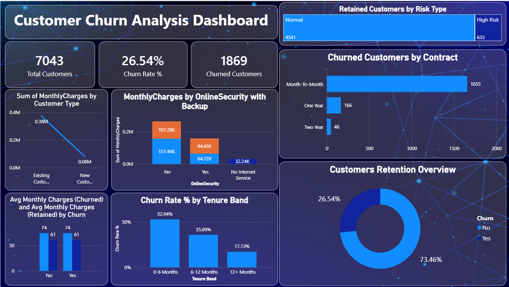

# Customer Churn Analysis Dashboard

## 📌 Project Overview
This project analyzes customer churn behavior using the Telco Customer Churn dataset. The dashboard was built in **Power BI** to identify key factors influencing customer attrition and provide actionable insights for improving customer retention.

The analysis focuses on customer demographics, contract types, tenure, monthly charges, online security services, and churn patterns.

---

## 🎯 Objectives
- Analyze customer churn trends and patterns.
- Identify high-risk customer segments.
- Understand the impact of tenure, contracts, and services on churn.
- Provide business insights to improve customer retention strategies.

---

## 🛠️ Tools & Technologies
- **Power BI** – Data Cleaning, Data Modeling, Visualization
- **Power Query** – Data Transformation
- **DAX** – Calculated Measures & KPIs
- **Excel/CSV Dataset** – Source Data

---

## 📂 Dataset Information
The dataset contains customer information including:

- Customer ID
- Gender
- Senior Citizen Status
- Partner & Dependents
- Tenure
- Contract Type
- Internet Service
- Online Security
- Monthly Charges
- Total Charges
- Payment Method
- Churn Status

---

## 📊 Dashboard KPIs

| KPI | Value |
|------|--------|
| Total Customers | 7,043 |
| Churned Customers | 1,869 |
| Churn Rate | 26.54% |
| Retained Customers | 5,174 |

---

## 📈 Key Insights

### 1. Customer Churn Rate
- Overall churn rate is **26.54%**.
- Around **1 out of every 4 customers** left the service.

### 2. Contract Type Analysis
- Customers with **Month-to-Month contracts** have the highest churn count (**1,655 customers**).
- Customers with **One-Year** and **Two-Year contracts** show significantly lower churn rates.

### 3. Tenure Impact
- Customers with **0–6 months tenure** have the highest churn rate (**52.94%**).
- Churn decreases as customer tenure increases.
- Customers staying beyond 12 months are more likely to remain loyal.

### 4. Online Security Impact
- Customers without Online Security services show higher monthly charge contributions and churn tendencies.
- Security-related services contribute positively to customer retention.

### 5. Retention Overview
- **73.46%** of customers are retained.
- **26.54%** of customers have churned.

---

## 📋 Data Cleaning & Transformation

The following data preparation steps were performed in Power BI:

- Removed duplicate records.
- Handled missing values.
- Converted data types.
- Created calculated columns.
- Generated DAX measures for KPIs.
- Created tenure segmentation bands.

### Tenure Band Logic

```DAX
Tenure Band =
IF(
    [tenure] <= 6, "0-6 Months",
    IF(
        [tenure] <= 12, "6-12 Months",
        "12+ Months"
    )
)
```

---

## 📊 DAX Measures Used

### Total Customers
```DAX
Total Customers = COUNT(Customer[customerID])
```

### Churned Customers
```DAX
Churned Customers =
CALCULATE(
    COUNT(Customer[customerID]),
    Customer[Churn] = "Yes"
)
```

### Churn Rate %
```DAX
Churn Rate % =
DIVIDE(
    [Churned Customers],
    [Total Customers]
) * 100
```

---

## 💡 Business Recommendations

### Improve New Customer Retention
- Implement onboarding programs for new customers.
- Provide welcome offers and engagement campaigns during the first 6 months.

### Promote Long-Term Contracts
- Encourage customers to switch from Month-to-Month plans to annual contracts through discounts and incentives.

### Bundle Security Services
- Offer Online Security packages at discounted rates to improve customer retention.

### Monitor High-Risk Customers
- Identify customers with:
  - Short tenure
  - Month-to-Month contracts
  - High monthly charges
- Target them with personalized retention campaigns.

---

## 📷 Dashboard Preview



---

## 🚀 Project Outcome
This dashboard helps businesses understand customer churn behavior, identify at-risk customers, and make data-driven decisions to improve customer retention and revenue growth.

---

## 👨‍💻 Author

**Akshutam Sharma**

- MCA Student | KIIT University
- Aspiring Data Analyst
- Skills: Power BI, SQL, Python, Pandas, NumPy, Excel

---
